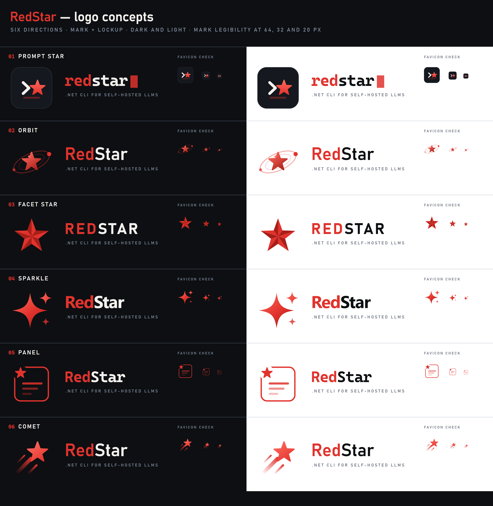

# RedStar logo concepts

Six directions for a RedStar mark, for review. **Nothing here is wired into the root `README.md`
yet** — pick one (or one to refine) first.

Start with the contact sheet, which puts every concept side by side on dark and light, with each
mark shrunk to 64/32/20 px as a favicon legibility check:



## The six

| # | Concept | Idea | Reads well small? |
|---|---|---|---|
| 01 | **Prompt Star** | Terminal chevron `>` and a star in an app tile, with a block cursor in the wordmark. Most literally "a CLI". | Tile survives to 32 px; the chevron+star mushes below that. |
| 02 | **Orbit** | Star with agent nodes on an orbital ring — the agent-orchestration ambition, not just the chat client. | Thin ring strokes disappear under ~32 px. |
| 03 | **Facet Star** | A faceted five-point star, folded-paper shading. The most literal reading of the name, and the most flag-like. | Yes — cleanest at every size. |
| 04 | **Sparkle** | Four-point sparkle, the current visual shorthand for "AI". Modern, but that shorthand is everywhere. | Yes. |
| 05 | **Panel** | A rounded panel with streaming lines and a star notched into the corner — a nod to the boxed streaming console UI. | Reads as a generic "document" icon at small sizes. |
| 06 | **Comet** | Star with a motion trail: speed, streaming tokens. | Trail fades out small; star alone still holds. |

## Files

Per concept, `NN-name-`:

- `mark.png` — 1024×1024, transparent background. The standalone symbol.
- `lockup-dark.png` / `lockup-light.png` — horizontal mark + wordmark + tagline, for a README
  header. Sized to the artwork, so widths differ per concept.
- `svg/` — the vector source of every PNG above. This is what you'd actually keep once a direction
  is picked; the PNGs are just for reviewing.

## Palette and type

| Role | Value |
|---|---|
| Primary red | `#E1332D` |
| Deep red (shading) | `#A81E19` |
| Light red (highlight) | `#FF6A5E` |
| Ink / dark background | `#0D0F12` (tile `#15181E`) |
| Off-white | `#F4F1EE` |
| Muted (tagline) | `#7C8698` dark / `#6B7280` light |

Wordmark type is per concept — Cascadia Mono for the terminal-flavored ones (01, 05), Bahnschrift
for 02/03/06, Segoe UI for 04. All three ship with Windows; if a direction is picked, the wordmark
should be converted to outlines so it renders identically everywhere.

Tagline placeholder is `.NET CLI FOR SELF-HOSTED LLMS`.

## Regenerating

Artwork is generated, not hand-drawn, so geometry stays exact and tweaks are cheap. From
`assets/logo/tools/` (needs Node and a Chrome install, which does the SVG → PNG rasterizing):

```bash
node gen.js          # writes ../svg/*.svg + measure.html
python measure.py    # measures real glyph widths via headless Chrome, writes measures.json
node gen.js          # regenerates with exact text widths so lockup canvases fit
python render.py     # rasterizes every SVG to ../*.png at 2x
```

The two `gen.js` passes exist because lockup canvas widths depend on how wide the wordmark actually
renders; the first pass emits a measuring page, the second uses its numbers.

Both Python scripts default to Chrome's standard Windows install path — set `CHROME` to override
(any Chromium build with `--headless --screenshot` works, Edge included).
